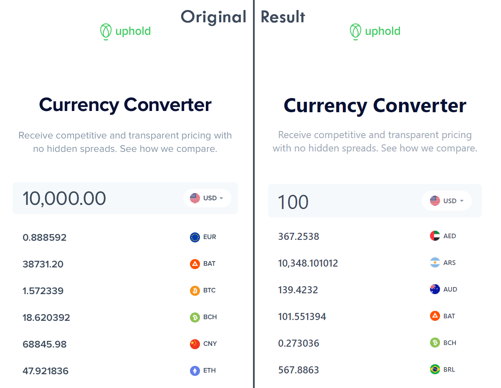

# Uphold's Frontend Engineer Assessment

This app is my take on Uphold's Frontend Engineer Assessment Challenge (January 2022).

The user, should be able to see an input amount displayed according to the exchange rates for the different currencies supported by Uphold.



## Index

- [Usage](#usage)
- [Technologies](#technologies)
- [Acceptance criteria](#acceptance-criteria)
- [Technical specs](#technical-specs)
- [Extra features](#extra-features)
- [Demo](#demo)
- [License](#license)

## Usage

To install all packages use the command:

```bash
yarn
```

To run the development server use:

```bash
yarn dev
```

## Technologies

- I used [Vite](https://vitejs.dev/) to create the `React` app instead of `CRA` because of its incredible speed.
- I also used `TypeScript` instead of `JavaScript` because I prefer statically-typed languages.
- For the styling, I used [Tailwind CSS](https://tailwindcss.com/) instead of plain `CSS` due to its faster styling process.
- For the versioning system, I used the [Conventional Commits](https://www.conventionalcommits.org/en/v1.0.0/) protocol to better organize my commits. I also used [Husky](https://github.com/typicode/husky) to add pre-commit lints and checks.

## Acceptance criteria

- [X] **TC01:** The user input amount should be USD by default.
- [X] **TC02:** Should be able to change between currencies.
- [X] **TC03:** Should update the values for every currency on user interaction using a
debounce mechanism.
- [X] **TC04:** Should have all the values cached upon the first request.
- [X] **TC05:** Should make a new API call in the background, re-populating the cached value,
when changing between currencies.

## Technical specs

To solve this problem the developer:

- [X] **MUST** use React.
- [X] **MUST** use ES6.
- [X] **MUST** list at least 10 different currencies.
- [X] **MUST** use the Uphold Javascript SDK.
- [X] **MAY** have proper linting tools.
- [X] **MAY** use the uphold design system.
- [ ] **MAY** handle CORS without having to rely on the browser extension.
- [X] **MAY** list all available currencies dynamically.
- [ ] **MAY** implement unit tests.
- [ ] **MAY** implement E2E tests.

## Extra features

- [X] Mobile friendly responsive design.
- [X] The currency input only accepts numbers and decimal separators.
- [X] The exchange rates are formatted with a thousands separator.
- [X] The currency input sticks to the top of the page on scroll for the user's convenience.
- [X] Only 10 currencies are shown initially, although the user can expand the list to see all of them.
- [ ] Sort the currencies from most to least used.

## Demo

I also attempted to host this app on `Netlify` to make it easier to present. Although, on the production build the `Uphold's SDK` was crashing.
With that being said, the app is still being hosted on [uphold-pmorim.netlify.app](https://uphold-pmorim.netlify.app/).

## License

MIT @ Pedro Morim
